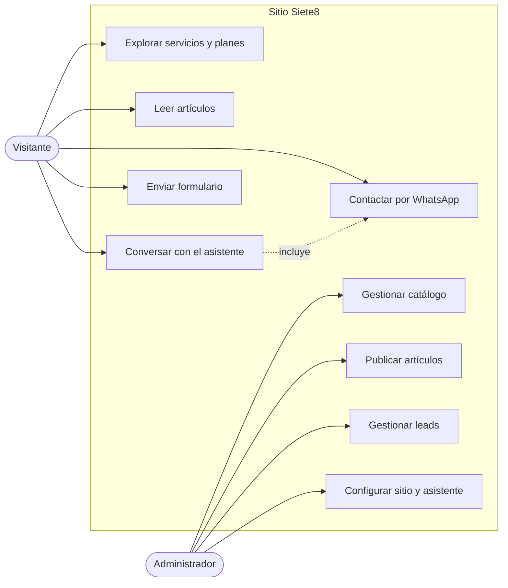
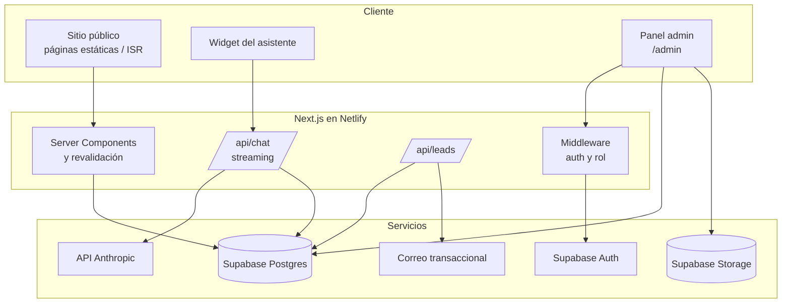
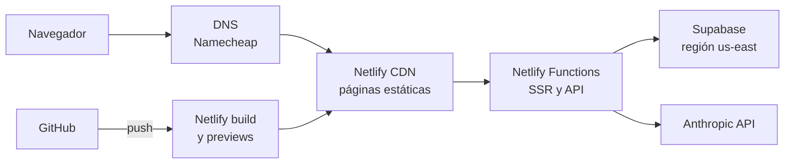
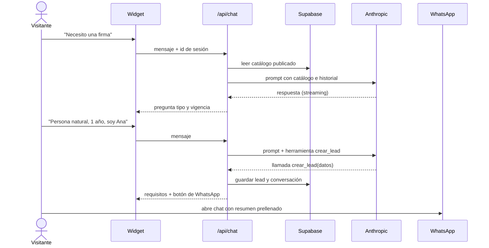
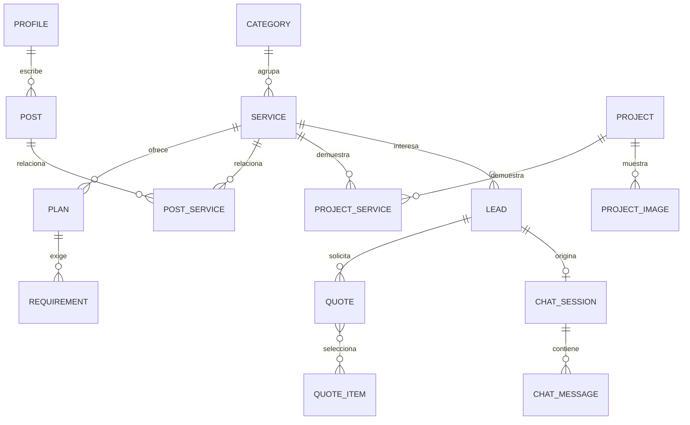

# SRS — Sitio web Siete8

Sep 24, 2026 · @Many

## 1. Introducción

### 1.1 Propósito

Este documento especifica los requisitos del nuevo sitio web de Siete8. Sirve como base para la lista de tareas, el desarrollo asistido con Claude Code y la validación del MVP.

### 1.2 Alcance

El sistema reemplaza el sitio actual (siete8.netlify.app, SPA en Vue sin contenido indexable). Tiene tres objetivos de negocio:

1. Presentar a Siete8 con un nivel visual y técnico que funcione como prueba de capacidad: quien lo visita debe inferir la calidad del trabajo que recibirá.
2. Mostrar el catálogo completo de servicios: sitios web, hosting, correo corporativo, firmas electrónicas, facturador electrónico, software de terceros y desarrollo a medida.
3. Generar solicitudes calificadas que terminen en el WhatsApp de Siete8, empezando por la venta de firmas electrónicas.

Queda fuera del alcance inicial: pagos en línea, área de clientes y carga de documentos personales en el sitio.

### 1.3 Definiciones

| Término | Significado |
| --- | --- |
| Visitante | Persona que navega el sitio sin autenticarse |
| Administrador | Usuario de Siete8 que gestiona contenido en el panel |
| Servicio | Oferta del catálogo con página propia (p. ej., firma electrónica) |
| Plan | Variante con precio de un servicio (p. ej., firma persona natural 1 año) |
| Lead | Solicitud de un visitante con datos de contacto e interés declarado |
| Asistente | Chatbot con IA que orienta al visitante y lo deriva a WhatsApp |
| Handoff | Paso del asistente a WhatsApp con un mensaje prellenado que resume la solicitud |
| SSG / ISR | Generación estática / regeneración incremental de páginas |
| LOPDP | Ley Orgánica de Protección de Datos Personales del Ecuador |

### 1.4 Referencias

- ISO/IEC/IEEE 29148:2018, ingeniería de requisitos.
- LOPDP (Registro Oficial, mayo 2021).
- Requisitos de emisión de firma electrónica de Click Identy (anexo B).

## 2. Descripción general

### 2.1 Perspectiva del producto

Sitio público con contenido administrable, un asistente conversacional y un panel de administración. El sitio público se genera estáticamente para SEO y velocidad; el panel y el asistente usan servicios del servidor.

### 2.2 Usuarios

| Perfil | Necesidad principal | Prioridad |
| --- | --- | --- |
| Persona natural | Firma electrónica rápida, a veces con RUC para facturar | Alta |
| Pyme / emprendedor | Web, dominio, correo corporativo, facturador, firma de representante legal | Alta |
| Administrador (Siete8) | Publicar servicios, precios y artículos; revisar leads | Alta |
| Empresa grande | Desarrollo a medida, hosting administrado | Media, sin contenido específico en MVP |

### 2.3 Funciones principales

- Portada con propuesta de valor, servicios destacados, prueba social y llamadas a la acción.
- Catálogo de servicios con página por servicio y planes con precio.
- Blog para SEO y como destino de publicaciones en redes sociales.
- Asistente con IA que responde dudas, recoge datos básicos y deriva a WhatsApp.
- Panel de administración para servicios, planes, artículos, leads y configuración.

### 2.4 Restricciones

- Stack: TypeScript y React. Decisión propuesta: Next.js (App Router) + Supabase (Postgres, Auth, Storage).
- Despliegue en Netlify; dominio siete8.com registrado en Namecheap. Contacto: WhatsApp comercial 0961128233, teléfono 0999843108, hola@siete8.com; atención de 07:00 a 20:00.
- Solo español.
- El sitio no recibe ni almacena fotos de cédula, RUC ni nombramientos; esos documentos se envían por WhatsApp (ver 4.4).
- Identidad visual (logo, colores) la entrega Siete8 en la documentación del proyecto.

### 2.5 Supuestos y dependencias

- La emisión de firmas se gestiona manualmente con Click Identy; no hay API de integración.
- El handoff a WhatsApp usa enlaces `wa.me` con texto prellenado, no la API de WhatsApp Business.
- El asistente usa la API de Anthropic con claves del lado del servidor.
- Los textos iniciales de servicios y el primer artículo de firmas los redacta Siete8 con apoyo de IA.

## 3. Requisitos funcionales

Prioridad MoSCoW: M = debe (MVP), S = debería (MVP si hay tiempo), C = podría (fase 2), W = no en esta versión.

### 3.1 Sitio público (PUB)

| ID | Requisito | Prioridad |
| --- | --- | --- |
| RF-PUB-01 | Portada con propuesta de valor, servicios destacados, proceso de trabajo, prueba social y CTA a WhatsApp | M |
| RF-PUB-02 | Página de catálogo que lista servicios agrupados por categoría | M |
| RF-PUB-03 | Página por servicio: descripción, para quién es, qué incluye, planes con precio, preguntas frecuentes, CTA | M |
| RF-PUB-04 | Tabla de planes comparables dentro del servicio (p. ej., firma natural vs jurídica por vigencia) | M |
| RF-PUB-05 | Sección de requisitos por plan (p. ej., documentos para firma) generada desde datos | M |
| RF-PUB-06 | Página "Nosotros" con historia, experiencia y enfoque | M |
| RF-PUB-07 | Página de contacto con WhatsApp, correo y formulario corto | M |
| RF-PUB-08 | Botón flotante de WhatsApp en todas las páginas | M |
| RF-PUB-09 | Página de portafolio con proyectos anteriores en tarjetas, filtrables por tipo de servicio | M |
| RF-PUB-10 | Política de privacidad y términos | M |
| RF-PUB-11 | Página 404 personalizada | S |
| RF-PUB-12 | Página por proyecto: cliente (o sector si no autoriza su nombre), año, reto, solución, resultado, tecnologías, galería de capturas y servicio relacionado | M |
| RF-PUB-13 | Cada proyecto se presenta según su estado (ver 3.7): solo el estado activo muestra enlace | M |
| RF-PUB-14 | Proyectos destacados en la portada y proyectos relacionados en cada página de servicio | M |

### 3.2 Blog (BLG)

| ID | Requisito | Prioridad |
| --- | --- | --- |
| RF-BLG-01 | Listado de artículos paginado, ordenado por fecha | M |
| RF-BLG-02 | Página de artículo con título, extracto, imagen de portada, autor, fecha, tiempo de lectura y cuerpo en Markdown | M |
| RF-BLG-03 | Artículos vinculados a servicios, con CTA al servicio relacionado | M |
| RF-BLG-04 | Etiquetas o categorías con listado filtrado | S |
| RF-BLG-05 | Metadatos Open Graph por artículo para vistas previas en redes y WhatsApp | M |
| RF-BLG-06 | Enlaces con parámetros UTM para medir tráfico desde cada red | S |

### 3.3 Asistente conversacional (AST)

| ID | Requisito | Prioridad |
| --- | --- | --- |
| RF-AST-01 | Widget de chat en todas las páginas, abierto por el visitante | M |
| RF-AST-02 | Responde sobre servicios, precios y requisitos usando solo el catálogo publicado como fuente | M |
| RF-AST-03 | Tono cercano y profesional, sin guiones rígidos; no inventa precios ni plazos | M |
| RF-AST-04 | Recoge nombre, servicio de interés y datos clave (p. ej., tipo y vigencia de firma) | M |
| RF-AST-05 | Genera el handoff: botón que abre WhatsApp con un resumen prellenado de la solicitud | M |
| RF-AST-06 | Registra la conversación y el lead en la base de datos | M |
| RF-AST-07 | Advierte que no se envíen documentos por el chat y los dirige a WhatsApp | M |
| RF-AST-08 | Límite de mensajes por sesión e IP para controlar costo y abuso | M |
| RF-AST-09 | Se puede activar o desactivar desde el panel sin desplegar | S |

### 3.4 Panel de administración (ADM)

| ID | Requisito | Prioridad |
| --- | --- | --- |
| RF-ADM-01 | Acceso con correo y contraseña o enlace mágico; solo usuarios con rol administrador | M |
| RF-ADM-02 | CRUD de categorías, servicios y planes (precio, vigencia, tipo, visibilidad, orden) | M |
| RF-ADM-03 | CRUD de requisitos por plan | M |
| RF-ADM-04 | CRUD de artículos con editor Markdown, vista previa, borrador / publicado y fecha programada | M |
| RF-ADM-05 | Carga de imágenes a almacenamiento con optimización | M |
| RF-ADM-06 | Listado de leads con estado (nuevo, contactado, cerrado, perdido) y notas | M |
| RF-ADM-07 | Lectura de conversaciones del asistente asociadas a un lead | S |
| RF-ADM-08 | Configuración global: número de WhatsApp, textos de CTA, redes sociales, prompt base del asistente | M |
| RF-ADM-09 | Al publicar o editar, el sitio público se actualiza sin despliegue manual (revalidación) | M |
| RF-ADM-10 | CRUD de proyectos del portafolio: datos, estado activo / archivado, galería ordenable, destacado, publicado | M |
| RF-ADM-11 | Panel de métricas básicas (leads por servicio y por fuente) | C |
| RF-ADM-12 | Activar o desactivar la visibilidad de categorías y servicios. Un servicio oculto responde 404, sale del menú, del sitemap, del cotizador y del contexto del asistente, y conserva sus datos | M |

### 3.5 Cotizador de sitios web (COT)

El cotizador entrega un rango de precio referencial con IVA en menos de un minuto y convierte la cotización en una conversación por WhatsApp. No reemplaza la cotización formal.

| ID | Requisito | Prioridad |
| --- | --- | --- |
| RF-COT-01 | Asistente paso a paso: tipo de sitio → páginas → funcionalidades → contenido e identidad → servicios recurrentes → resultado | M |
| RF-COT-02 | Cada paso muestra el subtotal actualizado en vivo | M |
| RF-COT-03 | Resultado: rango mínimo–máximo del pago único con IVA, costo recurrente mensual y anual, y plazo estimado de entrega | M |
| RF-COT-04 | El resultado se muestra sin pedir datos; el contacto se pide solo para recibir la cotización formal | M |
| RF-COT-05 | Botón "Enviar a WhatsApp" con el resumen de la selección prellenado | M |
| RF-COT-06 | Guarda la cotización y, si deja datos, crea un lead con origen "cotizador" | M |
| RF-COT-07 | Tipos que requieren análisis (tienda grande, sistema a medida) muestran "cotización personalizada" en vez de precio | M |
| RF-COT-08 | Reglas de dependencia e incompatibilidad entre opciones (p. ej., pasarela de pagos requiere tienda) | M |
| RF-COT-09 | Ítems, precios, rangos, unidades (único, por página, mensual, anual) y plazos editables en el panel | M |
| RF-COT-10 | Aviso visible: precio referencial, sujeto a revisión del alcance | M |
| RF-COT-11 | Descarga de la cotización en PDF con la marca de Siete8 | C |
| RF-COT-12 | Enlace compartible a una cotización guardada | C |

Modelo de datos adicional: `quote_item` (id, group: base / página / funcionalidad / contenido / recurrente, name, description, price\_min, price\_max, unit, requires\[\], excludes\[\], lead\_time\_days, active, order) y `quote` (id, lead\_id, selections jsonb, one\_time\_min, one\_time\_max, monthly, created\_at). Tabla de precios propuesta en el anexo C.

### 3.6 Facturación electrónica (FAC)

El facturador es un producto propio de Siete8, multi-tenant y ya desarrollado. El sitio lo presenta y lo vende; no se integra con él en el MVP más allá de enlaces.

| ID | Requisito | Prioridad |
| --- | --- | --- |
| RF-FAC-01 | Página de producto: para quién es (ventas esporádicas, negocios pequeños), funciones, capturas o video corto, planes y preguntas frecuentes | M |
| RF-FAC-02 | Tabla de planes con precio y límites (comprobantes por mes, usuarios, establecimientos), administrable desde el panel | M |
| RF-FAC-03 | CTA "Solicitar demo" y "Hablar por WhatsApp" | M |
| RF-FAC-04 | Botón "Ingresar" que abre la aplicación del facturador en su propio dominio | M |
| RF-FAC-05 | Venta cruzada: la página de firma electrónica recomienda el facturador y viceversa | M |
| RF-FAC-06 | Sección "Para integradores": el facturador se conecta con sistemas externos (POS, tiendas) vía API | S |
| RF-FAC-07 | Paquete combinado firma + facturador con precio propio | S |
| RF-FAC-08 | Registro y alta de empresa desde el sitio (autoservicio) | C |

Cambio en el catálogo: `service` agrega `kind` (servicio, producto propio, reventa) y `external_app_url`.

Condición previa a publicar esta página: el facturador debe estar en infraestructura de producción, con respaldos y monitoreo. Una falla en la emisión de facturas de un cliente cuesta más reputación que la venta que se gana.

### 3.7 Estados de los proyectos del portafolio

El estado describe la situación real del proyecto y es independiente de su publicación en el sitio y de si se muestra el nombre del cliente.

| Estado | Significado | Enlace | Etiqueta pública |
| --- | --- | --- | --- |
| En desarrollo | Proyecto en curso | No | Próximamente |
| Activo | En línea y sigue siendo la versión hecha por Siete8 | Sí | En línea |
| Interno | En producción, pero de acceso privado (intranet, BI, sistemas con login) | No | Uso interno del cliente |
| Reemplazado | El cliente sigue en línea, pero con un sitio que no es de Siete8 | No | Versión anterior |
| Archivado | Fuera de línea o terminado | No | Proyecto finalizado |

Campos relacionados: `published` (se muestra o no), `show_client_name` (nombre del cliente o solo el sector) y `featured` (destacado).

| ID | Requisito | Prioridad |
| --- | --- | --- |
| RF-POR-01 | El sistema revisa semanalmente las URL de los proyectos activos y avisa al administrador si una no responde; el cambio de estado lo decide el administrador | S |
| RF-POR-02 | Importación inicial desde el JSON del portafolio anterior, descargando las imágenes al almacenamiento propio | M |
| RF-POR-03 | Filtros públicos por tipo de servicio y tecnología | S |

### 3.8 Futuro (fuera del MVP)

| ID | Requisito | Prioridad |
| --- | --- | --- |
| RF-FUT-01 | Pagos en línea por plan | C |
| RF-FUT-02 | Área de clientes con servicios contratados y vencimientos | C |
| RF-FUT-03 | Recordatorios automáticos de renovación (hosting, dominio, firma) | C |
| RF-FUT-04 | Carga segura de documentos para firma, con cifrado y borrado automático | W |

## 4. Requisitos no funcionales

### 4.1 Rendimiento y SEO

| ID | Requisito | Métrica |
| --- | --- | --- |
| RNF-01 | Páginas públicas renderizadas en servidor o estáticas; el HTML contiene el contenido completo | Sin dependencia de JS para el contenido |
| RNF-02 | Core Web Vitals en móvil | LCP < 2,5 s, INP < 200 ms, CLS < 0,1 |
| RNF-03 | Puntaje Lighthouse en móvil (portada, servicio, artículo) | ≥ 90 en rendimiento, SEO y accesibilidad |
| RNF-04 | Metadatos por página: title, description, canonical, Open Graph, Twitter Card | 100 % de páginas públicas |
| RNF-05 | Datos estructurados JSON-LD: Organization, LocalBusiness, Service, Offer, Article, FAQPage | Validados sin errores |
| RNF-06 | sitemap.xml y robots.txt generados automáticamente | Actualizados al publicar |
| RNF-07 | Imágenes optimizadas (AVIF/WebP, tamaños responsivos, lazy loading) | Todas las imágenes |
| RNF-08 | Redirección 301 desde siete8.netlify.app al dominio propio | Configurada |

### 4.2 Diseño y experiencia

| ID | Requisito |
| --- | --- |
| RNF-09 | Diseño mobile-first; se valida primero en 360 px de ancho |
| RNF-10 | Estética de alto nivel acorde a la identidad de Siete8: tipografía cuidada, animaciones sutiles con respeto a `prefers-reduced-motion` |
| RNF-11 | Modo claro y oscuro |
| RNF-12 | Accesibilidad WCAG 2.1 AA: contraste, navegación por teclado, textos alternativos |
| RNF-13 | Cada página de servicio llega al CTA en máximo un scroll en móvil |

### 4.3 Seguridad

| ID | Requisito |
| --- | --- |
| RNF-14 | Row Level Security en todas las tablas de Supabase; lectura pública solo de contenido publicado |
| RNF-15 | Claves de Anthropic y service role solo en el servidor |
| RNF-16 | Protección anti-spam en formulario y asistente (Turnstile o equivalente + límite de tasa) |
| RNF-17 | Encabezados de seguridad: CSP, HSTS, X-Frame-Options, Referrer-Policy |
| RNF-18 | Rutas del panel protegidas por middleware y verificación de rol |

### 4.4 Privacidad y cumplimiento

| ID | Requisito |
| --- | --- |
| RNF-19 | Cumplimiento de la LOPDP: aviso de privacidad, finalidad del tratamiento y consentimiento antes de guardar datos del lead |
| RNF-20 | El sitio y el asistente no solicitan ni almacenan documentos de identidad; se envían por WhatsApp directamente a Siete8 |
| RNF-21 | Retención de conversaciones del asistente limitada (propuesta: 180 días) |
| RNF-22 | Precios mostrados con IVA incluido, según la normativa de defensa del consumidor |

### 4.5 Mantenibilidad y operación

| ID | Requisito |
| --- | --- |
| RNF-23 | TypeScript estricto, ESLint y Prettier; tipos generados desde el esquema de Supabase |
| RNF-24 | Migraciones de base de datos versionadas en el repositorio |
| RNF-25 | Despliegues de vista previa por rama en Netlify |
| RNF-26 | Analítica respetuosa de privacidad (propuesta: Plausible o GA4 con consentimiento) y eventos de conversión: clic en WhatsApp, lead creado, handoff del asistente |
| RNF-27 | Monitoreo de errores (propuesta: Sentry) |
| RNF-28 | Costo mensual del asistente acotado por límite de uso configurable |
| RNF-29 | MVP en el plan Free de Supabase: función programada diaria de Netlify que consulta la base para evitar la pausa por 7 días de inactividad |
| RNF-30 | Respaldo diario propio con pg\_dump desde GitHub Actions, con retención de 30 días, porque el plan Free no incluye respaldos |
| RNF-31 | Imágenes servidas a través del CDN de imágenes de Netlify para no consumir los 5 GB de transferencia de Supabase |

## 5. Interfaces externas

| Sistema | Uso | Mecanismo |
| --- | --- | --- |
| Supabase | Base de datos, autenticación del panel, almacenamiento de imágenes | SDK `@supabase/ssr`, RLS |
| API de Anthropic | Respuestas del asistente | Route Handler de Next.js con streaming; clave en variables de entorno |
| WhatsApp | Handoff y contacto | Enlace `https://wa.me/<número>?text=<resumen>` |
| Netlify | Hosting, funciones del servidor, vistas previas | Adaptador oficial de Next.js |
| Namecheap | Dominio | DNS apuntando a Netlify (o delegación de DNS a Netlify) |
| Cloudflare Turnstile | Anti-spam | Verificación en servidor |
| Analítica | Medición de tráfico y conversiones | Script de terceros con consentimiento |
| Correo transaccional | Aviso de nuevo lead al administrador | Propuesta: Resend |
| Click Identy | Emisión de firmas | Manual, fuera del sistema |

## 6. Modelos y diagramas

### 6.1 Casos de uso

El visitante llega a WhatsApp directamente o a través del asistente; el administrador gestiona todo desde el panel.

### 6.2 Componentes

Una sola aplicación Next.js sirve el sitio, el panel y las rutas de API; Supabase concentra datos, archivos y autenticación.

### 6.3 Despliegue

Cada push a GitHub genera una vista previa; la rama principal publica a producción.

### 6.4 Secuencia: solicitud de firma con el asistente

El asistente nunca pide documentos; entrega los requisitos y el enlace de WhatsApp con el resumen de la solicitud.

### 6.5 Modelo de datos

| Entidad | Campos clave |
| --- | --- |
| category | id, name, slug, order |
| service | id, category\_id, name, slug, summary, body\_md, icon, featured, published, order, seo\_title, seo\_description |
| plan | id, service\_id, name, holder\_type (natural, jurídica, n/a), duration, price\_without\_vat, vat\_rate, published, order |
| requirement | id, plan\_id, text, required, order |
| post | id, author\_id, title, slug, excerpt, body\_md, cover\_url, status (borrador, publicado), published\_at |
| lead | id, name, phone, email, service\_id, plan\_id, source (asistente, formulario, whatsapp), utm, status, notes, consent\_at |
| chat\_session | id, lead\_id, ip\_hash, started\_at |
| chat\_message | id, session\_id, role, content, created\_at |
| site\_settings | clave / valor (WhatsApp, redes, CTA, prompt del asistente, asistente activo) |
| profile | id (= auth.users), name, role |
| project | id, title, slug, client\_name, show\_client\_name, sector, year, summary, challenge\_md, solution\_md, results\_md, tech\_stack\[\], cover\_url, live\_url, status (en desarrollo, activo, interno, reemplazado, archivado), link\_checked\_at, link\_ok, featured, published, order |
| project\_image | id, project\_id, url, alt, device (escritorio, móvil), order |
| project\_service | project\_id, service\_id |

El precio se guarda sin IVA junto con la tasa; el sitio muestra el total con IVA calculado.

## 7. Fases y alcance del MVP

El MVP sale sin el asistente: vender firmas no depende de él, y es la pieza con más ajuste (prompt, costo, abuso). El botón de WhatsApp cubre el contacto desde el primer día.

| Fase | Contenido | Criterio de salida |
| --- | --- | --- |
| 1. MVP | Portada, catálogo, portafolio, página del facturador (si ya está en producción), páginas de servicio con planes y requisitos, blog, Nosotros, contacto, legales, panel (catálogo, artículos, leads, configuración), SEO técnico, dominio propio | Artículo de firmas publicado y landing de firmas indexable, con clics a WhatsApp medidos |
| 1.1 | Cotizador de sitios web; asistente con IA y handoff a WhatsApp | Precios del cotizador validados contra costos reales; 20 conversaciones reales revisadas sin respuestas inventadas |
| 2 | Métricas en el panel, etiquetas del blog | A definir |
| 3 | Pagos en línea, área de clientes, recordatorios de renovación | A definir |

### 7.1 Criterios de aceptación del MVP

- [ ] Todas las páginas públicas cumplen RNF-01 a RNF-08.
- [ ] El administrador crea un servicio con planes y requisitos, y aparece publicado sin desplegar.
- [ ] El administrador publica un artículo vinculado a un servicio y su vista previa en WhatsApp muestra imagen y título.
- [ ] Los precios se muestran con IVA incluido.
- [ ] Un lead desde el formulario llega al panel y genera aviso por correo.
- [ ] siete8.netlify.app redirige al dominio propio.

## 8. Pendientes y decisiones abiertas

- [ ] Validar la tabla del cotizador (anexo C) y los planes de hosting y correo (anexo E) contra costos reales.
- [ ] Tarifa por hora del soporte técnico.
- [ ] Planes y precios del facturador, su dominio de acceso y fecha de paso a producción; qué software de terceros se revende y con qué proveedor.
- [ ] Precios finales con IVA: los valores actuales +IVA dan totales irregulares (anexo A); decidir si se redondean.
- [ ] Capturas del portafolio y proyectos recientes que puedan sumarse.
- [ ] Herramienta de analítica (Plausible vs GA4).

## Anexo A. Catálogo inicial: firmas electrónicas

Precios definidos por Siete8 sin IVA; el total aplica IVA de 15 % (verificar tasa vigente al publicar).

| Vigencia | Natural sin IVA (USD) | Natural con IVA (USD) | Jurídica sin IVA (USD) | Jurídica con IVA (USD) |
| --- | --- | --- | --- | --- |
| 7 días | 6,99 | 8,04 | — | — |
| 30 días | 9,99 | 11,49 | — | — |
| 1 año | 17,99 | 20,69 | 20,99 | 24,14 |
| 2 años | 26,99 | 31,04 | 29,99 | 34,49 |
| 3 años | 36,99 | 42,54 | 39,99 | 45,99 |
| 4 años | 47,99 | 55,19 | 50,99 | 58,64 |
| 5 años | 54,99 | 63,24 | 57,99 | 66,69 |

Tiempo de entrega declarado: 5 a 10 minutos tras recibir los requisitos completos.

## Anexo B. Requisitos de emisión de firma

### Persona natural

- Fotografías de la cédula de identidad vigente, ambos lados (no copias).
- Fotografía de medio cuerpo sosteniendo la cédula a la altura del mentón; nítida, sin gafas, gorras ni mascarilla.
- RUC activo en PDF (obligatorio si se requiere facturación electrónica).
- Correo electrónico con acceso y espacio disponible.
- Número de celular activo, sin restricción de operadora y con buena señal para recibir el código de activación.

### Representante legal

- Fotografías de la cédula de identidad vigente, ambos lados.
- Fotografía de medio cuerpo sosteniendo la cédula a la altura del mentón; nítida, sin gafas, gorras ni mascarilla.
- RUC activo en PDF o copia de las dos hojas.
- Correo electrónico con acceso y espacio disponible.
- Número de celular activo, sin restricción de operadora y con buena señal.
- Nombramiento vigente, con carta de aceptación y razón de inscripción en el Registro Mercantil.
- Constitución notariada con razón de inscripción, si no está avalada por la Superintendencia de Compañías; o estatutos internos si no pertenece a ella (obligatorio).

## Anexo C. Tabla de precios del cotizador

Propuesta de Siete8 ubicada en el tramo medio del mercado: por encima de las plantillas baratas y por debajo de las agencias premium. Todos los valores en USD sin IVA; el cotizador suma el 15 % de IVA al mostrar. Son valores iniciales para validar contra los costos y horas reales de Siete8.

### C.1 Tipo de sitio (pago único)

| Tipo | Incluye | Mercado Ecuador 2026 | Propuesta Siete8 | Plazo |
| --- | --- | --- | --- | --- |
| Landing page | 1 página con secciones, formulario, WhatsApp, SEO técnico | 300–1.800 | 350–450 | 7–10 días |
| Sitio informativo | Hasta 5 páginas, diseño propio, SEO técnico | 700–3.500 | 650–850 | 2–3 semanas |
| Sitio autoadministrable | Hasta 8 páginas, panel, blog | 800–3.500 | 1.100–1.500 | 3–5 semanas |
| Tienda / catálogo | Productos, carrito, pedidos por WhatsApp | 1.200–8.000 | 1.500–2.200 | 4–6 semanas |
| Tienda con pasarela o sistema a medida | Según alcance | 2.000–50.000 | Cotización personalizada | Según alcance |

### C.2 Funcionalidades adicionales (pago único)

| Ítem | Unidad | Propuesta Siete8 |
| --- | --- | --- |
| Página adicional | Por página | 50–80 |
| Blog con panel (si el tipo no lo incluye) | Único | 200–300 |
| Catálogo de productos sin pagos | Único | 250–400 |
| Pasarela de pagos (Payphone, Kushki o Datafast) | Único + comisión de la pasarela | 300–450 |
| Integración con el facturador de Siete8 | Único | 150–250 |
| Reservas o citas en línea | Único | 150–250 |
| Asistente con IA y derivación a WhatsApp | Único + consumo mensual | 350–500 |
| Idioma adicional | Por idioma | 200–400 |
| Redacción de textos | Por página | 30–50 |
| Logo e identidad básica | Único | 150–250 |
| SEO inicial (Search Console, 5 palabras clave) | Único | 150–250 |

Las funcionalidades se estimaron por horas, con la tarifa de mercado de unos 30 USD por hora como referencia; el mercado no publica rangos por funcionalidad.

### C.3 Servicios recurrentes

| Ítem | Unidad | Mercado Ecuador 2026 | Propuesta Siete8 |
| --- | --- | --- | --- |
| Dominio .com | Anual | 20–35 | 20–25 |
| Dominio .ec / .com.ec | Anual | 35–50 | 45–55 |
| Hosting | Mensual | 10–35 | Ver anexo E |
| Correo corporativo | Mensual por cuenta | — | Ver anexo E |
| Mantenimiento básico: respaldos, actualizaciones, monitoreo | Mensual | 10–200 | 25–35 |
| Mantenimiento con cambios, hasta 2 h | Mensual | 10–200 | 55–70 |

### Fuentes

- [NM Tech Studio, precios 2026](https://www.nmtechstudio.com/blog/cuanto-cuesta-pagina-web-ecuador-2026): landing, corporativo, e-commerce, hosting y mantenimiento WordPress.
- [Azirgo, precios 2026](https://azirgo.com/blog/cuanto-cuesta-pagina-web-ecuador/): sitio profesional y hosting.
- [Terranode, precios 2026](https://terranode.net/es/blog/cuanto-cuesta-pagina-web-ecuador/): rangos publicados por agencias e IVA de 15 %.
- [Ecuasites, precios 2026](https://ecuasites.com/cuanto-cuesta-una-pagina-web-en-ecuador-2026/): dominios .com y .ec.
- [Vivoken, mantenimiento](https://vivoken.com/blog/cuanto-cuesta-el-mantenimiento-de-una-pagina-web-precios/): rango mensual de mantenimiento.
- [Estudio Novaidea, mantenimiento](https://www.estudionovaidea.com/blog/mantenimiento-web-cuanto-cuesta-y-que-incluye/): tarifa por hora en Ecuador.

## Anexo D. Catálogo completo de servicios

Todos los servicios del documento comercial se cargan en el catálogo; al lanzar se muestran solo los que Siete8 puede entregar hoy con casos que lo respalden. Las categorías se reorganizan por necesidad del cliente. La visibilidad es una propuesta y se cambia desde el panel (RF-ADM-12).

| Servicio | Categoría | Visible al lanzar | Motivo |
| --- | --- | --- | --- |
| Páginas web | Presencia digital | Sí | Servicio principal, con portafolio |
| Landing page | Presencia digital | Sí | Entrada de precio bajo del cotizador |
| Tiendas virtuales | Presencia digital | Sí | Mayor ticket en web |
| Hosting | Presencia digital | Sí | Ingreso recurrente, ya se vende |
| Correo corporativo | Presencia digital | Sí | Ingreso recurrente, ya se vende |
| Dominios | Presencia digital | Sí | Nuevo; complemento natural de web y correo |
| Firma electrónica | Trámites y cumplimiento | Sí | Nuevo; foco del lanzamiento |
| Facturación electrónica | Trámites y cumplimiento | Sí, si está en producción | Producto propio (3.6) |
| Asesoría y contabilidad (IVA, retenciones, renta, anexos) | Trámites y cumplimiento | No | Lo presta un contador aliado; al activarlo, la página debe decir quién presta el servicio |
| Apps y desarrollo a medida | Desarrollo y datos | Sí | Diferencial técnico de Siete8 |
| Análisis de datos / BI | Desarrollo y datos | Sí | 5 proyectos de DWH y BI en el portafolio (banca, seguros, salud) |
| Plataformas virtuales de educación | Desarrollo y datos | No | Activar cuando haya un caso publicable |
| Redes sociales | Marketing digital | No | Requiere capacidad operativa continua |
| Mailing | Marketing digital | No | Requiere capacidad operativa continua |
| Soporte técnico remoto o presencial | Soporte | Sí | Remoto en todo el país, presencial solo en Quito; cobro por hora |

Un servicio visible sin casos ni detalle concreto resta credibilidad al resto del catálogo; por eso la lista de lanzamiento es corta.

## Anexo E. Planes de hosting y correo corporativo

Todos los valores en USD sin IVA, anuales. Las cuotas de correo se configuran por buzón en DreamHost, entre 1 y 25 GB. Son propuestas a validar; los planes y precios se editan desde el panel.

### E.1 Costo base y tarifa actual

| Concepto | Valor |
| --- | --- |
| Hosting compartido DreamHost (web + correos de todos los clientes) | 191,88 en la plataforma; 230,25 con impuestos, anual |
| Tarifa actual por cliente | 77 + IVA al año: sitio web + 5 cuentas de correo (varía por cliente) |
| Clientes para cubrir el costo | 3 |

La tarifa actual está por debajo del mercado: el hosting solo, sin correo, se cotiza entre 10 y 35 al mes en Ecuador (anexo C.3). Se propone mantener 77 para los clientes actuales y aplicar los planes nuevos a los clientes nuevos.

### E.2 Hosting web + correo

| Plan | Incluye | Precio anual |
| --- | --- | --- |
| Web Básico | 1 sitio web + 3 cuentas de 5 GB | 99 |
| Web Negocio | 1 sitio web + 5 cuentas de 5 GB | 129 |
| Web Pro | 1 sitio web + 10 cuentas de 12 GB | 199 |
| Clientes actuales | 1 sitio web + hasta 5 cuentas | 77 (tarifa vigente) |

### E.3 Correo corporativo sin hosting web

Para clientes que tienen su sitio en otro lado o no tienen sitio.

| Plan | Cuentas | Espacio por cuenta | Precio anual |
| --- | --- | --- | --- |
| Correo Inicial | 1 | 5 GB | 18 |
| Correo Equipo | 3 | 5 GB | 45 |
| Correo Negocio | 5 | 5 GB | 69 |
| Correo Pro | 10 | 12 GB | 179 |

### E.4 Cuentas adicionales y ampliaciones

Aplican a cualquier plan de E.2 o E.3. Precio anual por cuenta.

| Espacio | Precio anual |
| --- | --- |
| 2 GB | 10 |
| 5 GB | 15 |
| 12 GB | 24 |
| 25 GB | 36 |

Ampliar una cuenta existente cuesta la diferencia entre ambos tamaños.

### E.5 Solo hosting web

| Plan | Para | Precio anual |
| --- | --- | --- |
| Sitio moderno | Sitios hechos por Siete8 en Netlify | 60 |
| WordPress | Sitios WordPress en DreamHost, sin correo | 79 |

Todos los planes incluyen configuración del dominio (SPF, DKIM, DMARC), configuración en celular y computadora, y soporte. Antes de vender cuentas de 12 y 25 GB en volumen, hay que revisar el límite total de almacenamiento del plan de DreamHost.

Fuentes: [DreamHost, correo](https://www.dreamhost.com/products/email/), [DreamHost, cuota de buzón](https://help.dreamhost.com/hc/en-us/articles/215975097-Adjust-the-email-storage-limit).

## Anexo F. Portafolio inicial

Doce proyectos del portafolio anterior, con estados confirmados por Siete8 el 25 de septiembre de 2026. Los nombres y descripciones se limitan a lo que ya estaba en el JSON del portafolio anterior.

| # | Proyecto | Tipo | Tecnologías | Estado propuesto | Observación |
| --- | --- | --- | --- | --- | --- |
| 1 | Bypass de aplicaciones BI | Aplicación web | Angular, Firebase, MicroStrategy | Interno | El enlace lleva a un login; no aporta al visitante |
| 2 | Encuestas A100 | Aplicación web | PHP MVC, SQL Server, PDI, MicroStrategy | Archivado | Sin enlace |
| 3 | Encuestas hospitalarias | Aplicación web | PHP MVC, SQL Server, Oracle, PDI, MicroStrategy | Archivado | Integración con sistemas de la clínica |
| 4 | DWH y piloto de BI con Hypercards | DWH / BI | SQL Server, MySQL, PDI, MicroStrategy | Interno | Cliente anónimo |
| 5 | BI de seguros y reportería a entes de control | DWH / BI | SQL Server, PDI, MicroStrategy | Interno | El caso más fuerte de BI; cliente anónimo por sector |
| 6 | Constelaciones Ecuador | Sitio web | WordPress | Reemplazado | El dominio hoy muestra una plantilla genérica de otro proveedor; no enlazar |
| 7 | Piloto de BI con Hypercards (banca) | BI | SQL Server, MicroStrategy | Interno | Considerar fusionarlo con el 4 o el 5 |
| 8 | FIGLAC | Sitio web | WordPress | Reemplazado | El sitio actual no es la versión de Siete8; no enlazar |
| 9 | DWH y BI empresarial | DWH / BI | SQL Server, PDI, MicroStrategy | Interno | Descripción muy corta; ampliar o fusionar |
| 10 | C&G Comercio Exterior | Landing page | WordPress | Archivado | Sin enlace |
| 11 | MBS Connection Flower | Sitio web | WordPress | Archivado | Sin enlace |
| 12 | Banco de Motos | Aplicación web | Laravel, MySQL | Reemplazado | El sitio actual no es la versión de Siete8; no enlazar |

Para la importación: las imágenes están enlazadas desde Google Drive con `uc?export=view`, un método que Google ya no garantiza para mostrar imágenes en sitios; se descargan y se guardan en Supabase Storage. Se corrigen erratas del texto original ("Businnes", "Implemantación", "administracion").
